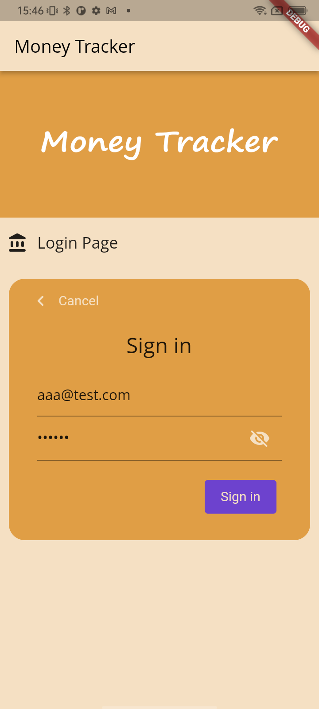

# Money Tracker

This is the Final assessment for CASA-0015


### This application is not completed. I am still working on it.

-----


## Introduce

The money tracker is an application to help users take note of their daily expenses. The inspiration is from finance management. Although we can view transactions from most of our bank Apps, some of them are not in detail, and sometimes, we use notes or do not pay by ourselves (by friends, family etc.). So, at least for me, I always miss some transactions, and hard to remember again. (e.g. What did I buy? How much did I pay? Where did I buy it?)

By using this app, users can manually enter the item description, amount, and optional upload of the receipt to save every expense in their daily life. In addition, users can view the items they saved with detailed information and the location where the item is created.

The app is login required. The account data and user data are safely stored based on the [Firebase platform](https://firebase.google.com/).

In addition, the homepage of the app contains a weather widget to fetch the current weather based on current location, powered by [OpenWeather API](https://openweathermap.org/api).

The image used in this assessment are created by myself.


## UI design





## Installation Instructions

#### Requirements

- Any Operating System (MacOS , Linux, Windows etc.)
- Any IDE with Flutter SDK installed (VSCode, Android Studio, XCode, etc.)
- Basic knowledge of Dart and Flutter
- Setup the Firebase App based on [Firebase Instructions and Docs](https://firebase.google.com/docs/)


#### Dependencies

Below are the dependencies used in the application

```
google_maps_flutter: ^2.1.2
permission_handler: ^9.2.0
location: ^4.3.0
geolocator: ^8.2.0
weather: ^2.0.1
camera: ^0.9.4+21
path_provider: ^2.0.9
path: ^1.8.0
cloud_firestore: ^3.1.14
firebase_auth: ^3.3.17
google_fonts: ^2.3.2
provider: ^6.0.2
firebase_core: ^1.12.0
sticky_grouped_list: ^2.1.0
bottom_bar: ^1.3.0+1
geocoding: ^2.0.4
intl: ^0.17.0
firebase_storage: ^10.2.16
```


## Online Tutorial

The implementation of some functions refers to the following websites.

+ App login feature:
  + based on Colab tutorial https://firebase.google.com/codelabs/firebase-get-to-know-flutter#0
  + and Firebase online tutorial on Youtube https://www.youtube.com/watch?v=wUSkeTaBonA&feature=emb_imp_woyt

+ OpenWeather API: [https://openweathermap.org/api](https://openweathermap.org/api)
+ Google Map API: [https://developers.google.com/maps](https://developers.google.com/maps)
+ Fetch weather is based on the example of [weather 2.0.1](https://pub.dev/packages/weather) flutter package.
+ Uploading image to Firebase Storage online tutorial on Youtube [Uploading Images to Firebase Storage (and retrieving them) - YouTube](https://www.youtube.com/watch?v=YgjYVbg1oiA&t=927s)


## Biblography

1. CodeWithChris (2022) *Uploading Images to Firebase Storage (and retrieving them)*. Available at: https://www.youtube.com/watch?v=YgjYVbg1oiA&t=927s (Accessed: 16 May 2022).
2. Firebase (2021) *Codelab: Get to know Firebase for Flutter*. Available at: https://www.youtube.com/watch?v=wUSkeTaBonA (Accessed: 05 May 2022).
3. Firebase (2021) *Get to know Firebase for Flutter*. Available at: https://firebase.google.com/codelabs/firebase-get-to-know-flutter#0  (Accessed: 05 May 2022).
4. Flutter (2022) *Flutter documentation*. Available at: https://docs.flutter.dev (Accessed: 01 May 2022).

----

## Declaration of Authorship

I, MINGHAO ZHANG, confirm that the work presented in this assessment is my own. Where information has been derived from other sources, I confirm that this has been indicated in the work. 


Minghao Zhang

18 May 2022


##  Contact Details

If you have any questions, please feel free to contact me: [minghao.zhang.21@ucl.ac.uk](minghao.zhang.21@ucl.ac.uk)

